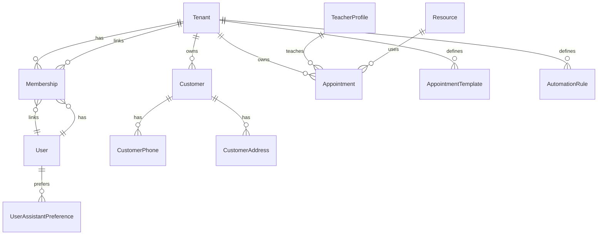

# Datenmodell — Alpiplan / ogama

Siehe ausführliches Prisma-Schema: [`../prisma/schema.prisma`](../prisma/schema.prisma).

## ER-Überblick (logisch)



## Soft Delete

Alle **Domänen-Entitäten** nutzen `deletedAt` (optional) und optional `deletedByUserId`. Standard-Abfragen filtern `deletedAt IS NULL`.

**Ausnahmen:** `AuditLog` (append-only), technische Tabellen (Sessions — bei Einführung), mobile Outbox (Client).

## Mandantenisolation

- Jede tenant-scoped Tabelle enthält `tenantId`.
- **RLS (Row Level Security)** in PostgreSQL: Phase 2; konzeptionell: `SET app.tenant_id = '<uuid>'` pro Request, Policies auf Tabellen.

## Empfohlene partielle Indizes (PostgreSQL)

Nach `prisma migrate` ggf. manuelle Migration ergänzen:

```sql
CREATE INDEX CONCURRENTLY idx_appointment_tenant_starts_active
  ON "Appointment" ("tenantId", "startsAt")
  WHERE "deletedAt" IS NULL;

CREATE INDEX CONCURRENTLY idx_customer_tenant_name_active
  ON "Customer" ("tenantId", "displayName")
  WHERE "deletedAt" IS NULL;
```

Trigram/GIN für Fuzzy-Suche (optional):

```sql
CREATE EXTENSION IF NOT EXISTS pg_trgm;
CREATE INDEX CONCURRENTLY idx_customer_displayname_trgm
  ON "Customer" USING gin ("displayName" gin_trgm_ops)
  WHERE "deletedAt" IS NULL;
```

## Prisma Client: Soft-Delete-Konvention

- Extension oder Base-Repository: alle `findMany`/`findFirst` standardmäßig `where: { deletedAt: null }`.
- Explizite Admin-Queries für Papierkorb: `where: { deletedAt: { not: null } }`.
